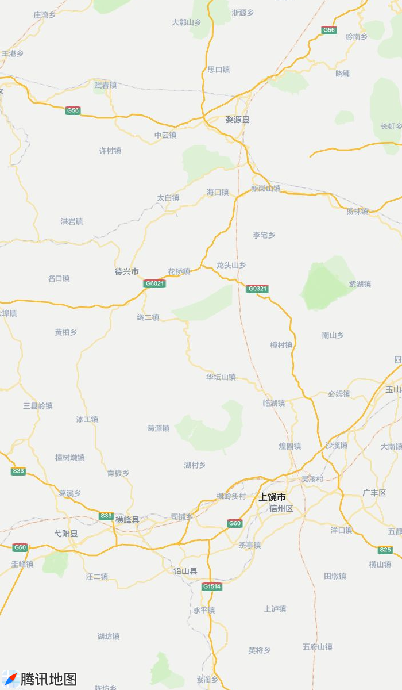

<header>
  

    
自 驾 出 游 · 江 西 上 饶

    <h1>上饶 4 天 3 晚自驾攻略</h1>
    
新余出发 · 9 月 26 日（周六）启程 · 三清山 + 望仙谷 + 婺源篁岭经典环线

    

      
<b>单程约 350 公里</b> · 4.5 小时

      
<b>全程约 1100 公里</b>（含景区间往返）

      
<b>人均门票约 600–700 元</b>

      
<b>已内置 17 个导航地址</b>，一键复制

    

  

</header>

  <strong>怎么用这份攻略的复制按钮：</strong>点每个地址右边的「复制」→ 打开高德地图 → 粘贴到搜索框 → 直接导航。地址已按「POI 名称 + 完整地址」的格式写好，高德能一次命中，不用你再挑候选。

  <strong>想先看清各景区的方位关系 →</strong> 点右下角的「景区位置图」按钮，或 <a href="#" @click.prevent="moOpen()">点这里展开</a>。15 个景区／节点已按真实经纬度标在地图上，点任意标注可看它到上饶市区的直线距离和方向。地图已内嵌本文，<strong>发给微信也能直接看</strong>。

<!-- ================= 出发前必看 ================= -->
<section>
  <h2>出发前必看：这 6 件事先定下来</h2>
  

    
① 你的出发日踩在中秋假期里，这是最大的变量

    
2026 年中秋节放假是 <strong>9 月 25 日（周五）至 27 日（周日）</strong>，你 9 月 26 日出发＝假期第二天。

    <ul>
      <li><strong>中秋高速不免费。</strong>免费通行只针对春节、清明、劳动节、国庆四个假期，中秋不在其中。你这趟高速费照付，单程约 160–180 元。</li>
      <li><strong>9 月 26 日–27 日是人流峰值。</strong>篁岭、三清山、望仙谷这两天排队会明显更久，住宿也贵。</li>
      <li><strong>好消息：9 月 28 日（周一）、29 日（周二）是普通工作日</strong>，人流断崖式下降。所以我把三清山排在 28 日——整个行程最累、最怕排队的一天，正好落在最空的日子。</li>
    </ul>
  

  

    
② 门票一律提前线上买，尤其是篁岭

    
婺源篁岭<strong>已全面实行线上购票预约</strong>，线上约满了、线下窗口也买不到。别到了门口才发现进不去。

    <ul>
      <li>购票渠道：微信小程序「牵景旅行」、携程、美团、同程，或各景区官方公众号。</li>
      <li><strong>现在就买</strong>：9/26 望仙谷、9/27 篁岭、9/28 三清山（含索道）。实名制，凭身份证入园。</li>
      <li>三清山务必买<strong>「门票 + 往返索道」套票</strong>，别只买门票。全程徒步上山会废掉你一整天。</li>
    </ul>
  

  

    
③ 天气：白天热、山上凉、午后爱下雨

    <ul>
      <li>9 月底婺源、上饶平原地带白天 <strong>30–34℃</strong>，紫外线强，短袖为主。</li>
      <li>三清山山顶海拔 1500 米以上，<strong>比山下低 8–10℃</strong>，早晚约 20℃ 甚至更低，风大。<strong>必须带一件薄外套或冲锋衣。</strong></li>
      <li>这个时节午后<strong>容易有雷阵雨</strong>，山区尤甚。折叠伞 + 轻便雨衣都带上。</li>
      <li>反过来说：<strong>雨后初晴是三清山云海最壮观的时候</strong>，如果 28 日早上下过雨，别沮丧，赶紧上山。</li>
    </ul>
  

  

    
④ 订房：现在就要动手，优先订这两处

    <ul>
      <li><strong>9/26 晚 上饶市区</strong>：房源多、好订，选万达/万力时代商圈，吃逛方便。</li>
      <li><strong>9/28 晚 三清山山下金沙服务区一带</strong>：这是一周内最紧的一晚之一，越早订越好。</li>
      <li>想住<strong>望仙谷悬崖民宿</strong>（推窗就是悬崖吊楼）或<strong>篁岭景区内晒秋美宿</strong>（能看夜景）的，假期里基本要提前 1–2 周抢。</li>
    </ul>
  

  

    
⑤ 最重要的一条：上饶景点极其分散

    
三清山、望仙谷、篁岭、葛仙村两两之间都是 <strong>1–2 小时车程</strong>，还全是山路。自驾已经是这里的<strong>最优解</strong>（比高铁+直通车灵活太多），但请守住一条铁律：

    
<strong>一天最多安排 2 个大景点，不要贪多。</strong>下面这份行程已经压缩到极限了。

  

  

    
⑥ 出发前一天再做两件事

    <ul>
      <li>查一遍各景区官方公众号的<strong>当日公告</strong>（索道运营时间、临时闭园、表演场次都会变）。</li>
      <li>把离线地图下载好。三清山、望仙谷的山路信号时好时坏。</li>
    </ul>
  

</section>
<!-- ================= 行程总览 ================= -->
<section>
  <h2>行程总览</h2>
  

    <table>
      <thead>
        <tr>
          <th>日期</th>
          <th>主线</th>
          <th>住宿</th>
        </tr>
      </thead>
      <tbody>
        <tr>
          <td class="num">9/26 周六</td>
          <td>新余 → 上饶市区 → <strong>望仙谷</strong>（下午进园，专挑夜景）</td>
          <td>上饶市区</td>
        </tr>
        <tr>
          <td class="num">9/27 周日</td>
          <td>上饶 → <strong>婺源篁岭</strong>（晒秋）→ <strong>婺女洲</strong>夜游</td>
          <td>婺源县城</td>
        </tr>
        <tr>
          <td class="num">9/28 周一</td>
          <td>婺源 → <strong>三清山</strong>（一整天，走环线）</td>
          <td>三清山山下</td>
        </tr>
        <tr>
          <td class="num">9/29 周二</td>
          <td>三清山 → 婺源古村（李坑/月亮湾）→ 返程新余</td>
          <td>—</td>
        </tr>
      </tbody>
    </table>
  

  

    为什么要这样排？两个原因： 
    ① <strong>三清山放周一</strong>，避开假期人流，全天不慌； 
    ② <strong>把三清山放在最后半段</strong>，返程时从三清山往西回新余比从婺源往西回新余更顺，最后一天不用赶。
  

  

    
总里程约 1100 公里

    
高速 + 油费（单车）约 1000–1200 元

    
门票（单人）约 600–700 元

    
2 人总预算约 3500–5000 元

  

</section>
<!-- ================= 每日详细 ================= -->
<section>
  <h2>每日详细行程（含当日导航点）</h2>
  <!-- DAY 1 -->
  

    

      DAY 1
      <h3 class="day-title">抵达上饶 · 望仙谷夜游</h3>
      新余 → 上饶 → 望仙谷 · 车程约 5.5h
    

    

      <ol class="tl">
        <li data-time="06:30">
          <strong>新余出发。</strong>走沪昆高速 G60 一路向东。假期首段车多，建议早走，别拖到 8 点以后。
        </li>
        <li data-time="09:00">
          途中在<strong>鹰潭服务区</strong>或樟树一带休息 15 分钟、加满油。上饶景区内加油站少且排队，山下加满最省心。
        </li>
        <li data-time="11:30">
          <strong>抵达上饶市区。</strong>从上饶西互通下高速，进城约 15 分钟。 
          午餐第一顿就吃本地味道：<strong>上饶炒粉</strong>配一份<strong>灯盏粿</strong>，市区老店十几块钱一份，锅气足。
        </li>
        <li data-time="13:00">
          <strong>出发去望仙谷</strong>（广信区望仙乡，约 40 公里山路，1 小时）。
        </li>
        <li data-time="14:00">
          <strong>望仙谷白天段。</strong>进园先走峡谷线：溪流、瀑布群、木质栈道、悬崖吊桥，一路往上。 
          重点：<strong>玻璃栈道</strong>俯瞰整条峡谷；<strong>悬崖吊脚楼群</strong>是这里的招牌，白天看建筑结构，晚上看灯光。
        </li>
        <li data-time="17:30">
          找地方吃晚饭。景区内小吃定价亲民（一碗粉 12–14 元），推荐<strong>油条包麻糍</strong>、<strong>灯盏粿</strong>、婺源汽糕。
        </li>
        <li data-time="19:00">
          <strong>等灯光秀——这才是望仙谷的精华。</strong>悬崖上的吊楼次第亮灯，暖黄灯光勾出山体轮廓，倒映在溪水里，就是网上那个「现实版仙侠世界」的画面。 
          建议中午先眯一会儿、下午晚点进园，直接连到晚上。
        </li>
        <li data-time="21:00">
          <strong>返回上饶市区住宿</strong>（1 小时）。如果订不到悬崖民宿，住市区是最划算的选择。
        </li>
      </ol>
      

        望仙谷门票 138–140 元
        开放约 9:30–23:00
        夜游 17:30 后亮灯，19:00 前后最佳
      

      

        
DAY 1 导航点（依次复制）

        

          📍
          <b>上饶市区（住宿/午餐）</b> 上饶万达广场 江西省上饶市信州区
          <button class="copy-btn" data-copy="上饶万达广场 江西省上饶市信州区">复制</button>
        

        

          📍
          <b>望仙谷景区</b> 望仙谷景区 江西省上饶市广信区望仙乡636县道
          <button class="copy-btn" data-copy="望仙谷景区 江西省上饶市广信区望仙乡636县道">复制</button>
        

      

    

  

  <!-- DAY 2 -->
  

    

      DAY 2
      <h3 class="day-title">婺源篁岭晒秋 · 婺女洲夜游</h3>
      上饶 → 篁岭 → 婺源县城 · 车程约 2h
    

    

      <ol class="tl">
        <li data-time="07:00">
          <strong>上饶市区出发去篁岭</strong>（婺源县江湾镇，约 95 公里，1.5–2 小时）。走德上高速/江湾出口，下高速再开 20 分钟到游客中心。
        </li>
        <li data-time="09:00">
          <strong>到篁岭，停车换索道上山。</strong>景区有停车场，直接停在游客中心最方便。 
          今天是假期第三天，人少一些，但仍建议 9 点前进园，索道排队最短
        </li>
        <li data-time="09:30">
          <strong>篁岭古村——晒秋的主场。</strong>这是整个行程里最出片的地方，9 月下旬晒秋已经完全铺开：红辣椒、黄玉米、南瓜片，一匾一匾铺满屋顶和窗台，配白墙黛瓦。 
          <strong>四个必到机位，记住这四处就够：</strong>
          <ul>
            <li><strong>晒工坊（三楼观景台）</strong>——俯拍整片晒秋全景，封面级大片就在这。可以体验晒秋 DIY。</li>
            <li><strong>五桂堂二楼</strong>——网红木质窗框，推窗取景，拍人像最出效果，还免费借竹匾当道具。</li>
            <li><strong>晒秋观景台</strong>——视野开阔，能俯瞰整个古村和梯田轮廓。</li>
            <li><strong>摄影吧</strong>——以窗为框的构图机位，随手一张像明信片。</li>
          </ul>
        </li>
        <li data-time="11:30">
          <strong>天街古巷。</strong>388 米明清石板老街，两侧是徽派老铺子，手作小店、竹编、徽绣。边走边吃：<strong>现捶麻糍裹黑芝麻白糖（趁热吃）、烤糍粑、厚汽糕</strong>。
        </li>
        <li data-time="13:30">
          <strong>花溪水街 + 垒心桥。</strong>水街水雾缭绕、溪水顺阶而下，走起来凉快。垒心桥是高空玻璃悬索桥（全长 298 米，垂直高约 98 米，中间 48 米玻璃段），恐高就走旁边普通步道，日落时分视野最好。
        </li>
        <li data-time="15:00">
          <strong>下山，去婺源县城吃正经一顿。</strong>必点<strong>糊豆腐</strong>——婺源宴席头菜，嫩豆腐捣碎加香菇丁、虾仁碎、肉末勾芡，卖相不好看但味道封神，人均 10–25 元。再配<strong>粉蒸肉</strong>和<strong>荷包红鲤鱼</strong>。
        </li>
        <li data-time="18:30">
          <strong>婺女洲度假区夜游。</strong>徽派建筑群 + 水上灯光秀，飞檐塔楼倒映水面。有《遇见·婺源》山水实景演出（嘉宾区约 70–100 元，VIP 约 110 元），还有非遗<strong>打铁花</strong>表演。灯光秀一般 18:30–22:30。
        </li>
        <li data-time="21:30">
          回婺源县城住宿（婺女洲离县城很近）。
        </li>
      </ol>
      

        篁岭门票+双程索道 145 元（假期/旺季周末可能 165 元）
        婺女洲 110–125 元
        索道下行有末班时间，不住景区内的话务必问清
      

      

        
DAY 2 导航点（依次复制）

        

          📍
          <b>婺源篁岭景区（游客中心 / 索道下站）</b> 婺源篁岭景区游客中心 江西省上饶市婺源县江湾镇篁岭村
          <button class="copy-btn" data-copy="婺源篁岭景区游客中心 江西省上饶市婺源县江湾镇篁岭村">复制</button>
        

        

          📍
          <b>婺源县城（住宿 / 吃饭）</b> 婺源县紫阳镇 江西省上饶市婺源县
          <button class="copy-btn" data-copy="婺源县紫阳镇 江西省上饶市婺源县">复制</button>
        

        

          📍
          <b>婺女洲度假区（夜游）</b> 婺女洲度假区 江西省上饶市婺源县文公北路8号
          <button class="copy-btn" data-copy="婺女洲度假区 江西省上饶市婺源县文公北路8号">复制</button>
        

      

      

        
篁岭一个关键决定

        
篁岭的夜景（纸灯巡游、亮灯后的古村）和白天完全是两个地方。但<strong>索道有末班时间</strong>，如果你不住景区内，就得赶在末班前下山。

        
两个选择：<strong>住景区内</strong>（晒秋美宿/天街酒店，推窗就是景，能安心看夜景，但贵且难订）；<strong>或住婺源县城</strong>（便宜、方便，但看不了篁岭夜景，改成去婺女洲看夜景补上）。我推荐后者，性价比更高。

      

    

  

  <!-- DAY 3 -->
  

    

      DAY 3
      <h3 class="day-title">三清山一整天（全程重点）</h3>
      婺源 → 三清山 · 车程约 2h
    

    

      <ol class="tl">
        <li data-time="07:00">
          <strong>婺源县城出发去三清山。</strong>约 90–100 公里，2 小时。今天是工作日，路上很空。
        </li>
        <li data-time="09:00">
          <strong>抵达索道下站，停车 + 换乘索道。</strong>三清山有两条索道，从婺源过来两条路都通： 
          · <strong>金沙索道（东部）</strong>——上站就在东方女神、巨蟒出山旁边，上山约 8 分钟直达核心区，多数人选这条； 
          · <strong>外双溪索道（南部）</strong>——如果你导航显示走南部更顺，就走这条，上去看到的景点是一样的。 
          假期高峰景区会叫号限流，金沙满员时会被引导到外双溪服务区停车，听现场指挥
        </li>
        <li data-time="09:30">
          <strong>三清山环线徒步开始（约 6–8 小时，不走回头路）。</strong>推荐动线： 
          <strong>索道上站 → 南清园 → 西海岸栈道 → 三清宫 → 阳光海岸 → 回索道下山</strong>
        </li>
      </ol>
      <h4>沿途不能错过的</h4>
      <ul>
        <li><strong>巨蟒出山</strong>——三清山三大绝景之一。巨型花岗岩石柱冲天而立，最细处直径仅约 7 米，站在下面会有点不真实感。</li>
        <li><strong>东方女神</strong>——三清山的标志景观，端坐云间的女神峰，也是三大绝景之一，观景台拍照最正。</li>
        <li><strong>西海岸栈道 / 阳光海岸栈道</strong>——修在崖壁上的高空栈道，一侧就是深谷。云雾翻涌时是整座山最震撼的位置，也是看云海的最佳机位。</li>
        <li><strong>一线天</strong>——两壁夹峙、石阶陡窄，走的时候收好手机。胖一点或者背大包的要侧身过。</li>
        <li><strong>三清宫</strong>——道教古建群，按先天八卦图式布局，藏在东北角的深山里，很多人走到一半就放弃了，其实很值得。</li>
        <li><strong>玉京峰 / 玉台</strong>——体力好、时间够再上，海拔最高的观景位，看群山和云海。</li>
      </ul>
      <h4>三清山的三条硬提醒</h4>
      <ul>
        <li><strong>上下都坐索道。</strong>门票和索道分开买，索道往返 125 元（上行 70 / 下行 55），别为省钱全程徒步，那会毁掉你一整天。</li>
        <li><strong>体力分配：</strong>南清园→西海岸→三清宫→阳光海岸是标准环线，走完约 6–8 小时。下午 3 点后如果还在三清宫，就往索道方向撤了。</li>
        <li><strong>山上物价翻倍，自带水和干粮。</strong>每人至少 1.5 升水，加巧克力/能量棒。山上有小卖部和餐厅，但贵且排队。</li>
      </ul>
      

        门票 120 元 + 往返索道 125 元
        索道运营约 7:30–17:30
        山上温度低 8–10℃，带外套
      

      

        
DAY 3 导航点（依次复制）

        

          📍
          <b>三清山金沙索道（东部 · 首选）</b> 三清山金沙索道 江西省上饶市玉山县三清山金沙服务区
          <button class="copy-btn" data-copy="三清山金沙索道 江西省上饶市玉山县三清山金沙服务区">复制</button>
        

        

          📍
          <b>三清山外双溪索道（南部 · 备选）</b> 三清山外双溪索道 江西省上饶市玉山县三清山外双溪服务区
          <button class="copy-btn" data-copy="三清山外双溪索道 江西省上饶市玉山县三清山外双溪服务区">复制</button>
        

      

      
<strong>下山后：</strong>住三清山山下金沙服务区一带的民宿/酒店。晚饭吃农家菜——<strong>高山蔬菜、笋干烧肉、土鸡汤、野菌汤</strong>，山里的笋干和菌菇是本地一绝。

    

  

  <!-- DAY 4 -->
  

    

      DAY 4
      <h3 class="day-title">婺源古村收官 · 返程</h3>
      三清山 → 婺源 → 新余 · 车程约 6.5h
    

    

      <ol class="tl">
        <li data-time="08:00">
          <strong>三清山出发，回婺源方向</strong>（约 2 小时），直接去东线古村。
        </li>
        <li data-time="10:00">
          <strong>李坑村</strong>——「小桥流水人家」的教科书版本，徽派古村的代表，一条溪穿村而过。逛 1.5 小时足够。 
          或者换成<strong>江湾</strong>（萧江大宗祠，人文底蕴厚）。 
          二选一即可，别两个都去
        </li>
        <li data-time="11:30">
          <strong>月亮湾</strong>——就在回程路上，免费的观景点，山水环绕的小岛形似弯月，是婺源的经典取景地。坐一段竹筏（约 45–50 元/人）也行，20 分钟看得出神。
        </li>
        <li data-time="12:30">
          <strong>婺源县城午餐 + 买伴手礼。</strong>再吃一顿糊豆腐、汽糕、清明粿。伴手礼推荐<strong>婺源皇菊</strong>（金丝皇菊，泡茶清冽）、<strong>婺源绿茶（茗眉）</strong>、<strong>弋阳年糕</strong>、<strong>酒糟鱼</strong>。
        </li>
        <li data-time="13:30">
          <strong>返程新余。</strong>走德上高速转沪昆高速，约 340 公里，4.5–5 小时。 
          今天是工作日，高速不堵，预计 18:00–19:00 到家
        </li>
      </ol>
      

        如果不想最后一天太赶，可以把 Day4 压成「上午直接返程」，古村放到 Day3 傍晚顺路看。但 Day3 已经从早到晚排满了，不建议。
      

      

        
DAY 4 导航点（依次复制）

        

          📍
          <b>李坑景区</b> 李坑景区 江西省上饶市婺源县秋口镇李坑村
          <button class="copy-btn" data-copy="李坑景区 江西省上饶市婺源县秋口镇李坑村">复制</button>
        

        

          📍
          <b>江湾景区（二选一）</b> 江湾景区 江西省上饶市婺源县江湾镇云湾路
          <button class="copy-btn" data-copy="江湾景区 江西省上饶市婺源县江湾镇云湾路">复制</button>
        

        

          📍
          <b>月亮湾</b> 婺源月亮湾 江西省上饶市婺源县秋口镇
          <button class="copy-btn" data-copy="婺源月亮湾 江西省上饶市婺源县秋口镇">复制</button>
        

        

          📍
          <b>返程起点：婺源县城</b> 婺源县紫阳镇 江西省上饶市婺源县
          <button class="copy-btn" data-copy="婺源县紫阳镇 江西省上饶市婺源县">复制</button>
        

      

    

  

</section>
<!-- ================= 景点详解 ================= -->
<section>
  <h2>景点详解：地址 · 玩法 · 门票</h2>
  

    

      <h3>三清山</h3>
      玉山县 · 5A · 世界自然遗产
    

    
<strong>一句话：</strong>花岗岩奇峰 + 悬崖高空栈道 + 云海，是上饶最"硬"的一张牌，也是唯一需要你动真格的一天。

    

      
门票120 元

      
往返索道125 元（上70/下55）

      
建议时长一整天（6–8h）

      
体力要求中高

    

    
<strong>玩什么：</strong>巨蟒出山、东方女神、西海岸栈道、阳光海岸栈道、一线天、三清宫、玉京峰、杜鹃谷。核心看点是<strong>花岗岩峰林 + 建在崖壁上的栈道 + 雨后云海</strong>。

    
<strong>怎么玩：</strong>索道上山 → 南清园（看三大绝景）→ 西海岸栈道（云海最佳）→ 三清宫 → 阳光海岸栈道 → 索道下山。全程不走回头路。

    
<strong>关键提醒：</strong>索道票另买；山上比山下低 8–10℃；自备 1.5L 水；雨后初晴云海最壮观，阴雨天可能什么都看不到，做好心理准备。

    

      
导航地址

      

        📍
        <b>三清山金沙索道</b> 三清山金沙索道 江西省上饶市玉山县三清山金沙服务区
        <button class="copy-btn" data-copy="三清山金沙索道 江西省上饶市玉山县三清山金沙服务区">复制</button>
      

      

        📍
        <b>三清山外双溪索道</b> 三清山外双溪索道 江西省上饶市玉山县三清山外双溪服务区
        <button class="copy-btn" data-copy="三清山外双溪索道 江西省上饶市玉山县三清山外双溪服务区">复制</button>
      

    

  

  

    

      <h3>望仙谷</h3>
      广信区 · 4A
    

    
<strong>一句话：</strong>悬崖上的吊脚楼 + 夜景灯光，全网刷屏的「现实版仙侠世界」。白天一般，<strong>晚上封神</strong>。

    

      
门票138–140 元

      
建议时长4–6 小时

      
开放约 9:30–23:00

      
最佳时段17:30 后

    

    
<strong>玩什么：</strong>峡谷溪流与瀑布群、玻璃栈道俯瞰全谷、悬崖吊桥、木质栈道、悬崖吊脚楼群、NPC 互动游戏、晚上的灯光秀。

    
<strong>怎么玩：</strong>下午两三点进园，白天走峡谷和栈道；傍晚吃小吃；<strong>19:00 前后灯光亮起</strong>，这是全场高潮。想拍照就带补光灯或开闪光灯。

    
<strong>关键提醒：</strong>景区内小吃价格亲民（一碗粉 12–14 元）；悬崖民宿贵且要提前很久订；如果不打算住那，晚上 21:00 前撤，山路夜里不好开。

    

      
导航地址

      

        📍
        <b>望仙谷景区</b> 望仙谷景区 江西省上饶市广信区望仙乡636县道
        <button class="copy-btn" data-copy="望仙谷景区 江西省上饶市广信区望仙乡636县道">复制</button>
      

    

  

  

    

      <h3>婺源篁岭</h3>
      婺源县江湾镇 · 5A
    

    
<strong>一句话：</strong>挂在半山崖上的徽派古村，晒秋晒成了「最美中国符号」。9 月下旬正好是晒秋最好的时段之一。

    

      
门票+双程索道145 元

      
假期/旺季周末约 165 元

      
建议时长4–6 小时

      
索道运营约 7:30–17:00

    

    
<strong>玩什么：</strong>晒工坊（晒秋最佳俯拍位）、五桂堂二楼（网红推窗人像）、晒秋观景台、摄影吧、天街古巷、花溪水街、垒心桥玻璃悬索桥。村里还有怪屋、倒屋这类趣味点，带小孩很合适。

    
<strong>怎么玩：</strong>索道上山 → 天街 → 四个观景机位逐个打卡 → 花溪水街 → 垒心桥 → 索道下山。傍晚如果不走，可以看古村亮灯和纸灯巡游。

    
<strong>关键提醒：</strong>篁岭<strong>必须提前线上预约购票</strong>，约满就没有现场票；65 岁以上老人和大学生有 60 元的优惠套票（凭有效证件）；假期周末尽量避开上午 10 点后的索道高峰。

    

      
导航地址

      

        📍
        <b>篁岭景区游客中心（索道下站）</b> 婺源篁岭景区游客中心 江西省上饶市婺源县江湾镇篁岭村
        <button class="copy-btn" data-copy="婺源篁岭景区游客中心 江西省上饶市婺源县江湾镇篁岭村">复制</button>
      

    

  

  

    

      <h3>婺女洲度假区</h3>
      婺源县城 · 夜游地标
    

    
<strong>一句话：</strong>人造但做得很好看，徽派建筑群 + 水上灯光秀，晚上比白天好看的典型。

    

      
门票110–125 元

      
灯光秀约 18:30–22:30

      
《遇见·婺源》70–110 元

      
建议时长3 小时

    

    
<strong>玩什么：</strong>徽派建筑群夜景观赏、水上灯光秀、《遇见·婺源》山水实景演出、非遗打铁花、抱玉塔 Mapping 秀。住景区内一般可免门票，订房前问清楚。

    
<strong>提醒：</strong>这是度假型景区，适合轻松收尾，不适合赶行程。演出和灯光秀的场次以景区当天公告为准。

    

      
导航地址

      

        📍
        <b>婺女洲度假区</b> 婺女洲度假区 江西省上饶市婺源县文公北路8号
        <button class="copy-btn" data-copy="婺女洲度假区 江西省上饶市婺源县文公北路8号">复制</button>
      

    

  

  

    

      <h3>婺源古村群（东线 / 北线）</h3>
      婺源县
    

    
<strong>一句话：</strong>婺源不是一个景点，是十几个古村，分散在不同方向，一天最多玩 2–3 个。

    

      
12 景点 5 日通票180 元

      
1 日联票150 元

      
单点（李坑/江湾）55–58 元

      
江岭20–25 元

    

    
<strong>怎么选：</strong>

    <ul>
      <li><strong>东线（推荐，顺路）</strong>：月亮湾 → 李坑 → 汪口 → 江湾 → 晓起 → 江岭。经典、成熟、配套好，但也最商业化。</li>
      <li><strong>北线（人少）</strong>：思溪延村 → 彩虹桥 → 灵岩洞 → 石城。安静、古朴，摄影党更喜欢，但更远。</li>
    </ul>
    
<strong>提醒：</strong>只玩 1–2 个村就别买通票，直接买单点票更划算。如果买了 5 日通票但只待一天，纯亏。

    

      
导航地址（按需复制）

      

        📍
        <b>月亮湾</b> 婺源月亮湾 江西省上饶市婺源县秋口镇
        <button class="copy-btn" data-copy="婺源月亮湾 江西省上饶市婺源县秋口镇">复制</button>
      

      

        📍
        <b>李坑景区</b> 李坑景区 江西省上饶市婺源县秋口镇李坑村
        <button class="copy-btn" data-copy="李坑景区 江西省上饶市婺源县秋口镇李坑村">复制</button>
      

      

        📍
        <b>江湾景区</b> 江湾景区 江西省上饶市婺源县江湾镇云湾路
        <button class="copy-btn" data-copy="江湾景区 江西省上饶市婺源县江湾镇云湾路">复制</button>
      

      

        📍
        <b>江岭景区（油菜花期 3–4 月最美）</b> 江岭景区 江西省上饶市婺源县溪头乡江岭村
        <button class="copy-btn" data-copy="江岭景区 江西省上饶市婺源县溪头乡江岭村">复制</button>
      

      

        📍
        <b>思溪延村（北线）</b> 思溪延村 江西省上饶市婺源县思口镇
        <button class="copy-btn" data-copy="思溪延村 江西省上饶市婺源县思口镇">复制</button>
      

      

        📍
        <b>彩虹桥（北线）</b> 婺源彩虹桥景区 江西省上饶市婺源县清华镇
        <button class="copy-btn" data-copy="婺源彩虹桥景区 江西省上饶市婺源县清华镇">复制</button>
      

    

  

  

    

      <h3>备选景点（时间富裕或想替换时用）</h3>
    

    

      <table>
        <thead>
          <tr><th>景点</th><th>位置</th><th>门票</th><th>特点 / 适合</th></tr>
        </thead>
        <tbody>
          <tr>
            <td><strong>葛仙村度假区</strong></td>
            <td>铅山县</td>
            <td class="price">127 元</td>
            <td>道家文化度假区，夜有灯光水舞秀、千灯盛会、火焰表演。适合度假、亲子、躺平型</td>
          </tr>
          <tr>
            <td><strong>龟峰</strong></td>
            <td>弋阳县</td>
            <td class="price">90 元起</td>
            <td>典型丹霞地貌，有游船，爬上爬下强度不大。适合返程路上半日游</td>
          </tr>
          <tr>
            <td><strong>灵山</strong></td>
            <td>广信区</td>
            <td class="price">95 元（含双程缆车约 175 元）</td>
            <td>离上饶市区最近的山，环状花岗岩峰林，有电梯上山，4–6 小时可走完</td>
          </tr>
          <tr>
            <td><strong>大茅山</strong></td>
            <td>德兴市</td>
            <td class="price">80 元起</td>
            <td>天然氧吧，人少清静</td>
          </tr>
          <tr>
            <td><strong>鄱阳湖国家湿地公园</strong></td>
            <td>鄱阳县</td>
            <td class="price">以景区公告为准</td>
            <td>观鸟、湿地，冬天候鸟季最好。离其他景点太远，这次不建议去</td>
          </tr>
        </tbody>
      </table>
    

    

      
备选景点导航地址

      

        📍
        <b>葛仙村度假区</b> 葛仙村度假区 江西省上饶市铅山县葛仙山镇永杨路
        <button class="copy-btn" data-copy="葛仙村度假区 江西省上饶市铅山县葛仙山镇永杨路">复制</button>
      

      

        📍
        <b>龟峰风景名胜区</b> 龟峰风景名胜区 江西省上饶市弋阳县320国道
        <button class="copy-btn" data-copy="龟峰风景名胜区 江西省上饶市弋阳县320国道">复制</button>
      

      

        📍
        <b>灵山风景区</b> 灵山风景区 江西省上饶市广信区清水乡左溪村乾坤路1号
        <button class="copy-btn" data-copy="灵山风景区 江西省上饶市广信区清水乡左溪村乾坤路1号">复制</button>
      

      

        📍
        <b>大茅山风景区</b> 大茅山风景区 江西省上饶市德兴市绕二镇
        <button class="copy-btn" data-copy="大茅山风景区 江西省上饶市德兴市绕二镇">复制</button>
      

    

  

</section>
<!-- ================= 导航地址总表 ================= -->
<section>
  <h2>导航地址总表（全部 17 个点）</h2>
  
按行程顺序排列。想一次性全部存下来的话，从前往后点「复制」，在高德收藏里逐条添加就行。

  

    

      📍
      <b>1. 上饶市区 · 住宿午餐</b> 上饶万达广场 江西省上饶市信州区
      <button class="copy-btn" data-copy="上饶万达广场 江西省上饶市信州区">复制</button>
    

    

      📍
      <b>2. 望仙谷景区</b> 望仙谷景区 江西省上饶市广信区望仙乡636县道
      <button class="copy-btn" data-copy="望仙谷景区 江西省上饶市广信区望仙乡636县道">复制</button>
    

    

      📍
      <b>3. 婺源篁岭景区（游客中心 / 索道下站）</b> 婺源篁岭景区游客中心 江西省上饶市婺源县江湾镇篁岭村
      <button class="copy-btn" data-copy="婺源篁岭景区游客中心 江西省上饶市婺源县江湾镇篁岭村">复制</button>
    

    

      📍
      <b>4. 婺源县城 · 住宿吃饭</b> 婺源县紫阳镇 江西省上饶市婺源县
      <button class="copy-btn" data-copy="婺源县紫阳镇 江西省上饶市婺源县">复制</button>
    

    

      📍
      <b>5. 婺女洲度假区</b> 婺女洲度假区 江西省上饶市婺源县文公北路8号
      <button class="copy-btn" data-copy="婺女洲度假区 江西省上饶市婺源县文公北路8号">复制</button>
    

    

      📍
      <b>6. 三清山金沙索道（东部 · 首选）</b> 三清山金沙索道 江西省上饶市玉山县三清山金沙服务区
      <button class="copy-btn" data-copy="三清山金沙索道 江西省上饶市玉山县三清山金沙服务区">复制</button>
    

    

      📍
      <b>7. 三清山外双溪索道（南部 · 备选）</b> 三清山外双溪索道 江西省上饶市玉山县三清山外双溪服务区
      <button class="copy-btn" data-copy="三清山外双溪索道 江西省上饶市玉山县三清山外双溪服务区">复制</button>
    

    

      📍
      <b>8. 李坑景区</b> 李坑景区 江西省上饶市婺源县秋口镇李坑村
      <button class="copy-btn" data-copy="李坑景区 江西省上饶市婺源县秋口镇李坑村">复制</button>
    

    

      📍
      <b>9. 江湾景区</b> 江湾景区 江西省上饶市婺源县江湾镇云湾路
      <button class="copy-btn" data-copy="江湾景区 江西省上饶市婺源县江湾镇云湾路">复制</button>
    

    

      📍
      <b>10. 月亮湾</b> 婺源月亮湾 江西省上饶市婺源县秋口镇
      <button class="copy-btn" data-copy="婺源月亮湾 江西省上饶市婺源县秋口镇">复制</button>
    

    

      📍
      <b>11. 江岭景区</b> 江岭景区 江西省上饶市婺源县溪头乡江岭村
      <button class="copy-btn" data-copy="江岭景区 江西省上饶市婺源县溪头乡江岭村">复制</button>
    

    

      📍
      <b>12. 思溪延村（北线）</b> 思溪延村 江西省上饶市婺源县思口镇
      <button class="copy-btn" data-copy="思溪延村 江西省上饶市婺源县思口镇">复制</button>
    

    

      📍
      <b>13. 彩虹桥（北线）</b> 婺源彩虹桥景区 江西省上饶市婺源县清华镇
      <button class="copy-btn" data-copy="婺源彩虹桥景区 江西省上饶市婺源县清华镇">复制</button>
    

    

      📍
      <b>14. 葛仙村度假区</b> 葛仙村度假区 江西省上饶市铅山县葛仙山镇永杨路
      <button class="copy-btn" data-copy="葛仙村度假区 江西省上饶市铅山县葛仙山镇永杨路">复制</button>
    

    

      📍
      <b>15. 龟峰风景名胜区</b> 龟峰风景名胜区 江西省上饶市弋阳县320国道
      <button class="copy-btn" data-copy="龟峰风景名胜区 江西省上饶市弋阳县320国道">复制</button>
    

    

      📍
      <b>16. 灵山风景区</b> 灵山风景区 江西省上饶市广信区清水乡左溪村乾坤路1号
      <button class="copy-btn" data-copy="灵山风景区 江西省上饶市广信区清水乡左溪村乾坤路1号">复制</button>
    

    

      📍
      <b>17. 大茅山风景区</b> 大茅山风景区 江西省上饶市德兴市绕二镇
      <button class="copy-btn" data-copy="大茅山风景区 江西省上饶市德兴市绕二镇">复制</button>
    

  

</section>
<!-- ================= 美食 ================= -->
<section>
  <h2>美食：按区域吃，别乱跑</h2>
  
上饶美食分布规律很清楚：<strong>上饶市区吃炒粉和灯盏粿，婺源吃糊豆腐和红鲤鱼，铅山弋阳吃烫粉和年糕，三清山吃山货。</strong>

  <h3>上饶市区 / 信州区</h3>
  

    <table>
      <thead>
        <tr><th>美食</th><th>是什么</th><th>参考价</th><th>怎么点</th></tr>
      </thead>
      <tbody>
        <tr>
          <td><strong>上饶炒粉</strong></td>
          <td>上饶人的早餐信仰。米粉爽滑、锅气足，配肉丝、豆芽、辣椒</td>
          <td class="price">10–20 元</td>
          <td>市区老店随便挑，看排队最长的那家。加个煎蛋和一份卤味</td>
        </tr>
        <tr>
          <td><strong>灯盏粿</strong></td>
          <td>传统米粿，形状像灯盏，馅料鲜香，可蒸可煎</td>
          <td class="price">5–10 元</td>
          <td>街头小吃摊、老巷子口都有，煎的比蒸的香</td>
        </tr>
        <tr>
          <td><strong>清明粿 / 艾米粿</strong></td>
          <td>艾草汁和糯米粉做的皮，包笋丁肉馅，清香软糯</td>
          <td class="price">5–10 元</td>
          <td>凉了也好吃，适合带上路当干粮</td>
        </tr>
        <tr>
          <td><strong>弋阳年糕</strong></td>
          <td>上饶招牌特产，古法「三蒸两百锤」，软糯 Q 弹</td>
          <td class="price">15–30 元</td>
          <td>炒年糕最推荐，也能煮汤。走时买真空包装当伴手礼</td>
        </tr>
      </tbody>
    </table>
  

  <h3>婺源</h3>
  

    <table>
      <thead>
        <tr><th>美食</th><th>是什么</th><th>参考价</th><th>怎么点</th></tr>
      </thead>
      <tbody>
        <tr>
          <td><strong>糊豆腐</strong>必吃</td>
          <td>婺源红白喜事的头菜。嫩豆腐捣碎 + 香菇丁 + 虾仁碎 + 肉末，勾芡煮成豆腐粥</td>
          <td class="price">10–25 元</td>
          <td>卖相很丑，但味道封神。<strong>随便一家小炒店都有，不踩雷</strong></td>
        </tr>
        <tr>
          <td><strong>荷包红鲤鱼</strong></td>
          <td>婺源特产鱼，通体红、形似荷包，肉质细嫩</td>
          <td class="price">60–120 元/条</td>
          <td>清蒸最能吃出鲜味，红烧更下饭。县城饭店都有</td>
        </tr>
        <tr>
          <td><strong>粉蒸肉 / 粉蒸鱼</strong></td>
          <td>米粉裹肉蒸到软烂，江西粉蒸菜的代表</td>
          <td class="price">30–50 元</td>
          <td>配糊豆腐一起吃，本地人标准组合</td>
        </tr>
        <tr>
          <td><strong>婺源汽糕</strong></td>
          <td>米浆发酵蒸成，口感松软微酸，是婺源特色早餐</td>
          <td class="price">5–10 元</td>
          <td>配一碗粥或豆浆，本地人的早晨</td>
        </tr>
        <tr>
          <td><strong>灰汁果</strong></td>
          <td>用草木灰水做的米粿，带一点独特碱香</td>
          <td class="price">5–10 元</td>
          <td>古村里的小摊，尝尝鲜</td>
        </tr>
      </tbody>
    </table>
  

  <h3>铅山 / 弋阳 / 玉山 / 三清山</h3>
  

    <table>
      <thead>
        <tr><th>美食</th><th>哪里吃</th><th>参考价</th><th>点评</th></tr>
      </thead>
      <tbody>
        <tr>
          <td><strong>铅山烫粉</strong></td>
          <td>铅山县（葛仙村附近）</td>
          <td class="price">10–18 元</td>
          <td>米粉配鸭血、牛杂，汤头浓郁，早餐一碗很顶</td>
        </tr>
        <tr>
          <td><strong>玉山炒粉</strong></td>
          <td>玉山县城</td>
          <td class="price">10–18 元</td>
          <td>和上饶炒粉同源，粉更细一点</td>
        </tr>
        <tr>
          <td><strong>三清山农家菜</strong></td>
          <td>金沙服务区一带民宿</td>
          <td class="price">人均 60–100 元</td>
          <td>高山蔬菜、笋干烧肉、土鸡汤、野菌汤。<strong>山里的笋干和菌菇是亮点</strong></td>
        </tr>
        <tr>
          <td><strong>油条包麻糍</strong></td>
          <td>望仙谷 / 婺源街头</td>
          <td class="price">10–15 元</td>
          <td>油条裹糯麻糍蘸糖，咸甜交织，望仙谷网红小吃</td>
        </tr>
        <tr>
          <td><strong>弋阳油淋鱼</strong></td>
          <td>弋阳县</td>
          <td class="price">50–90 元</td>
          <td>弋阳另一道名菜，辣香浓，返程路上去弋阳可试</td>
        </tr>
      </tbody>
    </table>
  

  <h3>伴手礼清单</h3>
  <ul>
    <li><strong>婺源皇菊（金丝皇菊）</strong>——泡开一朵金灿灿的，清肝明目，颜值高，最适合送人。</li>
    <li><strong>婺源绿茶（茗眉）</strong>——中国名茶，婺源茶田品质好。</li>
    <li><strong>弋阳年糕</strong>——真空包装好带，回家炒一炒就行。</li>
    <li><strong>婺源酒糟鱼</strong>——本地特色下饭菜。</li>
    <li><strong>葛粉（葛仙山特产）</strong>——可冲饮，清热解毒。</li>
    <li><strong>三清山/玉山南瓜干</strong>——脆甜零食，路上就能吃。</li>
    <li><strong>甲路油纸伞、龙尾砚（歙砚）</strong>——婺源非遗手作，送人有面子。</li>
  </ul>
</section>
<!-- ================= 餐厅推荐 ================= -->
<section>
  <h2>特色餐厅推荐（附拿手菜）</h2>
  

    评分与人均来自大众点评／携程公开评价、三清山景区官网榜单、地方政府与本地美食号整理，会随季节浮动，以到店为准。
    <strong>上饶、婺源菜普遍重油偏辣</strong>，点单时说一句"少辣"店家都会调。旺季饭点排队久，建议错峰。
  

  <h3>上饶市区（信州区）· Day1 落地就吃</h3>
  

    

      <b>帝景米粉</b>东方帝景广场 1 层人均 15 元
    

    
拿手手工牛肉米粉、汤粉

    
开了十多年的早餐地标，本地人叫它"早餐命"。汤底用牛骨＋猪骨熬 12 小时，米粉劲道，配酥脆炸豆腐和秘制辣酱。<strong>06:00–14:00</strong>，过了中午就没了。辣椒用的是本地小米辣，怕辣先说。

  

  

    

      <b>小杨菜馆</b>江南商贸城永隆服装城 1-27 号本地人叫"食堂"
    

    
拿手辣椒炒肉、酸萝卜蛋皮、黄豆烧鸡爪／梅干菜烧鸡爪、鱼头烧豆腐、红烧大黄鱼、鳜鱼

    
环境很朴素，但基本全是本地人落座，现炒现烧吃的是锅气。鸡爪两道菜选一个就行，软烂入味不腻；想吃鲜就点鱼，鱼头烧豆腐和小河鱼都不会错。

  

  

    

      <b>农家客</b>大景头（原青春歌舞厅对面）上过《上饶晚报》
    

    
拿手血鸭、牛腩粉皮、九秒爆炒牛百叶、砂锅肉丸汤

    
比小杨菜馆更"农家"、更原汁原味，整体辣度也更高。<strong>不太能吃辣的一定要提前交代</strong>。这几道都是需要手艺的菜，属于本地人认可的实力派。

  

  

    

      <b>鱼膳房客馆</b>信州区带湖路 98 号人均 65 元
    

    
拿手笋炒腊肉、红烧鱼

    
老字号，很多本地人请客吃饭的首选。装修有江西老宅的味道，墙上挂着老上饶黑白照片。笋的清甜配腊肉的咸香是这里的招牌组合。<strong>10:00–22:00</strong>。

  

  

    

      <b>粮苑小吃</b>信州区解放路粮食局院内（无招牌）私房菜，每日限量
    

    
拿手红烧排骨（限量）、炒螺丝（加薄荷）、"挖机"汤、炒鸭丁

    
藏在老粮食局居民楼里，没招牌、从不宣传，只有老上饶人吃惯的私房口味。加了薄荷的炒螺蛳和本地叫法的"挖机汤"是别处吃不到的味道。<strong>09:30–21:00</strong>，菜品随当季变动。

  

  

    

      <b>茅缘灯盏粿</b>带湖路 2 号 / 上饶老街人均 20 元
    

    
拿手灯盏粿、清凉补

    
本地人的深夜食堂，<strong>11:00–23:00</strong>。灯盏粿外皮酥脆内里软糯；清凉补是十几种中药材熬的养生甜汤，配方传了三代，每天凌晨 4 点开始熬，解腻最合适。

  

  

    

      <b>胡子夜宵</b>信州区信江中路开了 30 多年
    

    
拿手炒粉、大杂烩

    
夫妻两人守了三十多年的苍蝇小馆，从傍晚 6 点开到凌晨 3 点。想吃最市井的上饶宵夜，来这就对了。

  

  

    

      <b>永乐包</b>水南街 227 号06:30–11:30
    

    
拿手小笼包（配一碗粉再加豆浆是本地标准吃法）

    
在外地的上饶人说"除了想家就是想这一口"。早餐组合：一碗粉 + 一笼包子 + 一碗豆浆。

  

  

    

      <b>徐氏肉粽</b>信州区解放路顾家巷 11 号火了 20 多年
    

    
拿手蛋黄肉粽

    
老上饶提"三八旅社门口的粽子"就知道是哪家。肉要肥瘦相间、腌足一整天，靠的就是实在。<strong>05:00–18:00</strong>。

  

  <h3>婺源 · Day2、Day4 吃这里</h3>
  

    

      <b>廖厨（文公北路店）</b>婺源县文公北路人均 60–80 元
    

    
拿手糊豆腐、清蒸荷包红鲤鱼

    
几乎是婺源本地人的"家庭聚餐首选"，环境宽敞、停车方便。想一次性把婺源特色尝全，来这家最省心——糊豆腐料足层次分明，荷包红鲤鱼处理得干净无土腥味。

  

  

    

      <b>常相聚土菜馆</b>江湾镇栗木坑篁岭村4.8 分 · 人均 64 元
    

    
拿手本地土菜、时令山货

    
就在篁岭村口，是篁岭一带评分最高的一家。<strong>Day2 从篁岭下来直接吃这家最顺路。</strong>饭点人多，建议 11:30 前或 13:30 后到。

  

  

    

      <b>婺香源乡村菜馆（十五年土菜店）</b>蚺城街道文公北路 3 号（开元名庭酒店对面）4.6 分 · 人均 59 元
    

    
拿手婺源农家菜

    
在婺源县城，开了十五年的土菜馆，老板会耐心介绍菜品特色。<strong>10:30–22:00</strong>，适合 Day2 晚上回县城吃。

  

  

    

      <b>农家小院土菜馆</b>紫阳镇茶乡西路与才仕大道交叉口4.8 分 · 人均 62 元
    

    
拿手农家土菜

    
县城里评分最高的一家之一。<strong>11:00–14:30 / 16:30–22:00</strong>，注意午市打烊时间，别扑空。

  

  

    

      <b>文英饭店</b>婺源县天佑路人均 40 元吃四菜一汤
    

    
拿手糊豆腐、粉蒸肉、荷包红鲤鱼

    
本地人扎堆的家常馆，做法最地道，价格最实在。想省钱又想吃对味，这家性价比最高。

  

  

    

      <b>光明茶楼</b>婺源县沿江路人均 50–70 元
    

    
拿手粉蒸肉、灰汁粿

    
二十多年老字号，装修朴实有烟火气。傍晚去坐靠窗的位置，能一边吃一边看星江河。

  

  

    

      <b>老家食府（弦高古城店）</b>蚺城街道天佑西路 59 号4.6 分 · 人均 50 元
    

    
拿手粉蒸南瓜（底下垫米饭，吸饱肉汁）

    
靠着弦高古城，逛完夜景顺路吃。<strong>10:00–21:00</strong>。

  

  

    

      <b>正宗江氏农家菜 · 十六年</b>江湾镇云湾路（江湾景区）4.6 分 · 人均 64 元
    

    
拿手家常婺源菜

    
开在江湾景区里，环境温馨雅致。Day4 去江湾的话就在门口吃。<strong>10:00–22:00</strong>。

  

  

    

      <b>天街食府</b>篁岭景区内人均 40–60 元
    

    
拿手晒秋宴系列、糊豆腐、荷包红鲤鱼

    
虽然开在景区里，但味道地道，主要服务住在山上的游客和景区工作人员。用餐时能直接看梯田和晒秋。<strong>秋季限定的"晒秋宴"值得试。</strong>

  

  

    

      <b>樊老头樊氏牛骨粉</b>婺源县书香路步行街人均 25 元
    

    
拿手牛骨粉

    
上饶最地道的牛骨粉之一。牛骨高压炖足 4 小时，肉软烂、骨髓香浓，牛肉现切现卖。<strong>07:00–21:00</strong>，早餐来一碗最合适。

  

  <h3>三清山山下 · Day3 晚餐（金沙／外双溪服务区）</h3>
  
以下为三清山景区官网发布的"评价最高农家小炒"榜单，按点评分数排序。金沙服务区在你入住那一侧，外双溪在南部，按你实际下山的位置选。

  

    

      <b>老味道徽府菜</b>三清山东部金沙服务区4.83 分 · 329 条 · 人均 68
    

    
拿手徽菜、本地菜

    
三清山山下评分第一。<strong>入住金沙服务区就直接吃这家。</strong>

  

  

    

      <b>原味缘菜馆</b>三清山东部金沙服务区4.75 分 · 611 条 · 人均 57
    

    
拿手江西本地菜

    
点评量最大的一家，说明翻台快、口碑稳，性价比比第一家更高。

  

  

    

      <b>安馨家常菜</b>三清山东部金沙服务区4.52 分 · 713 条 · 人均 60
    

    
拿手本地家常菜

    
金沙服务区第三选择，713 条点评说明是本地常青店。

  

  

    

      <b>三清风味</b>三清山南部外双溪服务区4.63 分 · 969 条 · 人均 78
    

    
拿手江西本地菜

    
外双溪那边点评量最多的一家（969 条）。如果你走南部索道下山，吃这家。

  

  

    

      <b>三清家厨</b>三清山南部外双溪服务区4.45 分 · 193 条 · 人均 71
    

    
拿手本地家常菜

    
外双溪服务区的备选，评分与上家接近。

  

  <h4>三清山这几道是必点的</h4>
  <ul>
    <li><strong>土鸡汤</strong>——当地放养跑山鸡炖的，汤色金黄澄亮，下山后暖身解乏的第一选择。</li>
    <li><strong>笋干炒腊肉</strong>——笋干泡发后配本地土猪腊肉爆炒，咸香脆嫩，最下饭。</li>
    <li><strong>三清小溪鱼</strong>——溪流小炸到酥脆再用干辣椒炒，连骨头都能吃。</li>
    <li><strong>红烧土猪肉 / 高山时蔬 / 葛粉豆腐</strong>——高山蔬菜比平地清甜，葛粉豆腐 Q 弹，别处少见。</li>
  </ul>
  <h4>山上的选择（不便宜，但有特色）</h4>
  <ul>
    <li><strong>女神宾馆餐厅</strong>（南清园核心区）——石耳炖鸡，石耳是长在花岗岩上的菌，炖汤清甜，徒步后恢复体力很合适。</li>
    <li><strong>日上山庄驿站</strong>——热姜茶、茶叶蛋、现煮牛肉面，海拔 1200 米处来一碗热汤。</li>
    <li><strong>三清宫道观斋饭</strong>——豆腐、笋干、山野菜的素斋，最"有仙气"的一餐。</li>
    <li>山上快餐 40–60 元一份且味道一般，<strong>建议自带干粮上山，正餐留到山下吃，便宜一半以上。</strong></li>
  </ul>
  <h3>铅山 / 玉山 · 顺路就吃</h3>
  

    

      <b>铅山烫粉（金沙镇店）</b>三清山金沙镇人均 18 元
    

    
拿手铅山烫粉

    
现烫米粉配肉丝笋干，鲜辣爽口。上饶人的早餐灵魂，登山前一天晚上或当天早上来一碗。

  

  

    

      <b>婺源土菜馆（金沙镇）</b>三清山金沙镇人均 30 元
    

    
拿手婺源糊豆腐

    
在金沙镇就能吃到糊豆腐，30 元一份。

  

  

    

      <b>老街年糕</b>玉山县城人均 15 元
    

    
拿手弋阳年糕（手工打制，软糯弹牙）

    
切片油炸或煮汤都行。<strong>玉山县城的夜市是本地人的美食天堂</strong>，炒粉、烧烤、小龙虾都有，Day3 下山早的话可以去逛。

  

  

    <strong>点单总原则：</strong>① 糊豆腐是婺源宴席头菜，随便一家小炒店都不踩雷；② 荷包红鲤鱼认准"活水养殖、现杀现做"，清蒸最显本味；③ 汽糕、清明粿这类米食要现做现吃，打包会失去软糯口感；④ 买酒糟鱼、皇菊这类特产，优先老街老字号，别在景区门口买。
  

</section>
<!-- ================= 住宿 ================= -->
<section>
  <h2>住宿怎么定</h2>
  

    <table>
      <thead>
        <tr><th>日期</th><th>住哪</th><th>价位（参考）</th><th>为什么</th></tr>
      </thead>
      <tbody>
        <tr>
          <td class="num">9/26</td>
          <td><strong>上饶市区</strong>（万达 / 万力时代商圈）</td>
          <td>200–350 元</td>
          <td>房源多好订，吃逛方便，去望仙谷来回都顺</td>
        </tr>
        <tr>
          <td class="num">9/27</td>
          <td><strong>婺源县城</strong></td>
          <td>200–400 元</td>
          <td>便宜、配套全，离婺女洲很近，去篁岭也方便</td>
        </tr>
        <tr>
          <td class="num">9/28</td>
          <td><strong>三清山山下金沙服务区</strong></td>
          <td>300–600 元</td>
          <td>第二天不用早起赶路，索道就在旁边。<strong>这一晚最紧，优先订</strong></td>
        </tr>
      </tbody>
    </table>
  

  <h4>想升级体验的话</h4>
  <ul>
    <li><strong>望仙谷悬崖民宿</strong>——推窗就是悬崖吊楼和灯光，氛围拉满，但价格高、必须提前 1–2 周订。</li>
    <li><strong>篁岭景区内晒秋美宿 / 天街酒店</strong>——能推窗看晒秋晨景和夜景，是拍清晨空景的唯一办法。</li>
    <li><strong>三清山山上酒店</strong>——看星空和日出云海，但条件一般、价格高、餐食选择少。</li>
    <li><strong>婺女洲 / 葛仙村景区内</strong>——住景区内一般可免大门票，订房前一定确认清楚。</li>
  </ul>
</section>
<!-- ================= 自驾注意事项 ================= -->
<section>
  <h2>自驾 & 安全注意事项</h2>
  

    <h4>路线与里程</h4>
    <ul>
      <li><strong>新余 → 上饶：</strong>沪昆高速 G60 直达，约 350 公里，正常 4.5 小时。中途经樟树、鹰潭。</li>
      <li><strong>上饶 → 望仙谷：</strong>约 40 公里，1 小时，后半段是山路。</li>
      <li><strong>上饶 → 篁岭：</strong>约 95 公里，1.5–2 小时。</li>
      <li><strong>婺源 → 三清山：</strong>约 90–100 公里，2 小时。</li>
      <li><strong>三清山 → 新余：</strong>约 400 公里，4.5–5 小时。</li>
      <li>单程过路费约 160–180 元（<strong>中秋不免费，国庆才免费</strong>）。</li>
    </ul>
  

  

    <h4>山区驾驶要点</h4>
    <ul>
      <li><strong>隧道多、弯道急、限速变化频繁。</strong>去三清山、望仙谷的路尤其要注意，别跟大车太近。</li>
      <li><strong>进山前加满油。</strong>上饶市区、婺源县城、三清山金沙服务区有加油站，山区沿途很少。</li>
      <li><strong>夜路尽量别开。</strong>望仙谷回上饶那段山路夜里照明差，能 21:00 前撤就撤。</li>
      <li><strong>提前下离线地图。</strong>三清山、望仙谷信号时断时续。</li>
      <li><strong>停车：</strong>篁岭停游客中心停车场；三清山停金沙服务区（换乘索道），高峰期限流时可能被引导到外双溪服务区；婺源古村各有小停车场，旺季可能满。</li>
      <li><strong>婺源东线路窄</strong>，周末会车要慢，别在村口乱停。</li>
    </ul>
  

  

    <h4>装备清单</h4>
    <ul>
      <li><strong>必备：</strong>运动鞋或登山鞋（三清山必须）、薄外套/冲锋衣、折叠伞、防晒霜、驱蚊液。</li>
      <li><strong>建议：</strong>轻便雨衣（山上风大伞不好用）、保温杯、充电宝、纸巾湿巾。</li>
      <li><strong>三清山专用：</strong>每人 1.5L 水 + 能量棒/巧克力，护膝（下台阶伤膝）。</li>
      <li><strong>拍照：</strong>三清山穿亮色（云海背景出片）、篁岭穿素色（衬托晒秋色彩）、婺源古村穿汉服或新中式最搭。</li>
      <li><strong>证件：</strong>身份证（实名购票入园）、驾照、行驶证、学生证/老年证（有优惠）、少量现金。</li>
    </ul>
  

  

    <h4>避坑清单</h4>
    <ul>
      <li><strong>别信车站拉客的高价拼车</strong>，认准官方渠道的景区直通车。</li>
      <li><strong>婺源景点别贪多</strong>，东线一天最多 2–3 个村，古村看着近、实际要开 1 小时。</li>
      <li><strong>婺源通票要想清楚</strong>：只待一天就别买 5 日通票（180 元），买单点票更划算。</li>
      <li><strong>篁岭索道末班时间</strong>是硬约束，不住景区内就务必问清当天时间，否则会被困山上。</li>
      <li><strong>三清山阴雨天可能什么都看不到</strong>，出发前看天气预报，雨后初晴才是最佳窗口。</li>
      <li><strong>篁岭晒秋是季节性的</strong>（立秋后有、11 月最盛），但 9 月下旬已经铺开了，你这个时间点没问题。</li>
      <li><strong>不要在景区门口买"野味"</strong>，包括所谓野生石鸡——多为受保护物种，正规餐厅也不用野生。</li>
      <li><strong>假期住宿提前订</strong>，现场找房基本又贵又差。</li>
    </ul>
  

</section>
<!-- ================= 费用 ================= -->
<section>
  <h2>费用预算（2 人 4 天 3 晚）</h2>
  

    <table>
      <thead>
        <tr><th>项目</th><th>明细</th><th>金额（元）</th></tr>
      </thead>
      <tbody>
        <tr>
          <td>油费</td>
          <td>约 1100 公里 × 0.7 元/公里</td>
          <td class="price">约 750</td>
        </tr>
        <tr>
          <td>过路费</td>
          <td>往返高速（中秋不免费）</td>
          <td class="price">约 400</td>
        </tr>
        <tr>
          <td>门票</td>
          <td>望仙谷 140×2 + 篁岭 145×2 + 婺女洲 115×2 + 三清山（120+125）×2</td>
          <td class="price">约 1290</td>
        </tr>
        <tr>
          <td>住宿</td>
          <td>上饶 1 晚 + 婺源 1 晚 + 三清山 1 晚</td>
          <td class="price">700–1400</td>
        </tr>
        <tr>
          <td>餐饮</td>
          <td>人均 100–150/天</td>
          <td class="price">800–1200</td>
        </tr>
        <tr>
          <td>停车 / 杂项</td>
          <td>景区停车、索道小交通、小吃</td>
          <td class="price">200–300</td>
        </tr>
        <tr>
          <td><strong>合计</strong></td>
          <td>—</td>
          <td><strong>约 4100–5400</strong></td>
        </tr>
      </tbody>
    </table>
  

  
想压预算：住婺源县城而非景区内、篁岭和婺女洲二选一、少买套票里的附加项目。想加体验：望仙谷悬崖民宿 + 篁岭景区内住宿，一晚各加 300–600 元。

</section>
<!-- ================= 弹性方案 ================= -->
<section>
  <h2>如果天数不一样，怎么改</h2>
  

    <table>
      <thead>
        <tr><th>天数</th><th>怎么砍 / 怎么加</th></tr>
      </thead>
      <tbody>
        <tr>
          <td><strong>只有 3 天</strong></td>
          <td>砍掉 Day4 的古村，第四天上午直接从三清山返程。或者砍掉望仙谷，改成「上饶 → 篁岭 → 三清山」三站。</td>
        </tr>
        <tr>
          <td><strong>4 天（本方案）</strong></td>
          <td>三清山 + 望仙谷 + 篁岭 + 婺女洲 + 婺源古村，节奏刚好，不赶。</td>
        </tr>
        <tr>
          <td><strong>5–6 天</strong></td>
          <td>加一天<strong>葛仙村</strong>（铅山，适合躺着看灯光水舞秀）；或加一天<strong>龟峰</strong>（丹霞地貌，半天够）；或把婺源北线（思溪延村、彩虹桥、石城）单独排一天。</td>
        </tr>
      </tbody>
    </table>
  

</section>
<!-- ================= 出发清单 ================= -->
<section>
  

    
照着做就行：出发前的动作清单

    <ol style="margin-bottom:0;">
      <li>订 9/26 上饶市区、9/27 婺源县城、9/28 三清山山下的住宿。</li>
      <li>线上买好望仙谷、篁岭、三清山（门票+往返索道）、婺女洲的门票。</li>
      <li>9/25 查一遍各景区公告的索道时间和演出场次。</li>
      <li>出发前一晚加满油，装好外套、雨具、登山鞋。</li>
      <li>9/26 早上 6:30 出发，11:30 到上饶吃炒粉。</li>
      <li>把上面「导航地址总表」里的地址逐个复制到高德收藏，路上直接调。</li>
    </ol>
  

</section>
<footer>
  
门票、营业时间、索道末班时间均以各景区当日官方公告为准，出发前请再确认一次。 
  本攻略按 2026 年 9 月 26 日出发、4 天 3 晚行程编制。

</footer>

<button id="mapFab" type="button" @click="moOpen()">&#128506;&#65039; 景区位置图</button>

  

    

      <h2>上饶景区位置总览</h2>
      
15 个景区／节点 · 按真实经纬度标注 · 底图 &copy; 腾讯地图

    

    <button class="mo-close" type="button" @click="moClose()" aria-label="关闭">&#10005;</button>
  

  

    

      
      <svg id="moSvg" viewBox="0 0 700 1200" preserveAspectRatio="xMidYMid meet" aria-hidden="true"></svg>
      
<button class="x" type="button" @click="moHideCard()" aria-label="关闭">&#10005;</button>

    

    
虚线为行程顺序示意（非实际道路）。「距离／方位」是相对<strong>上饶市区</strong>的直线距离与方向，非驾车里程。双指可缩放查看细节。

    

    

  

